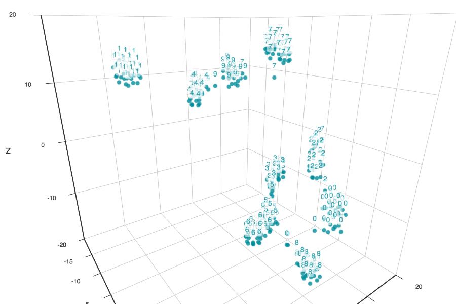

## Visualizing Embedding in the VisualDL

The official VisualDL does not have have the functionality to use a list as word vector. This example requires such feature to visualize the embedding in high dimension space.

Please download and build this [special version of VisualDL](https://github.com/ziyuli/VisualDL.git)
